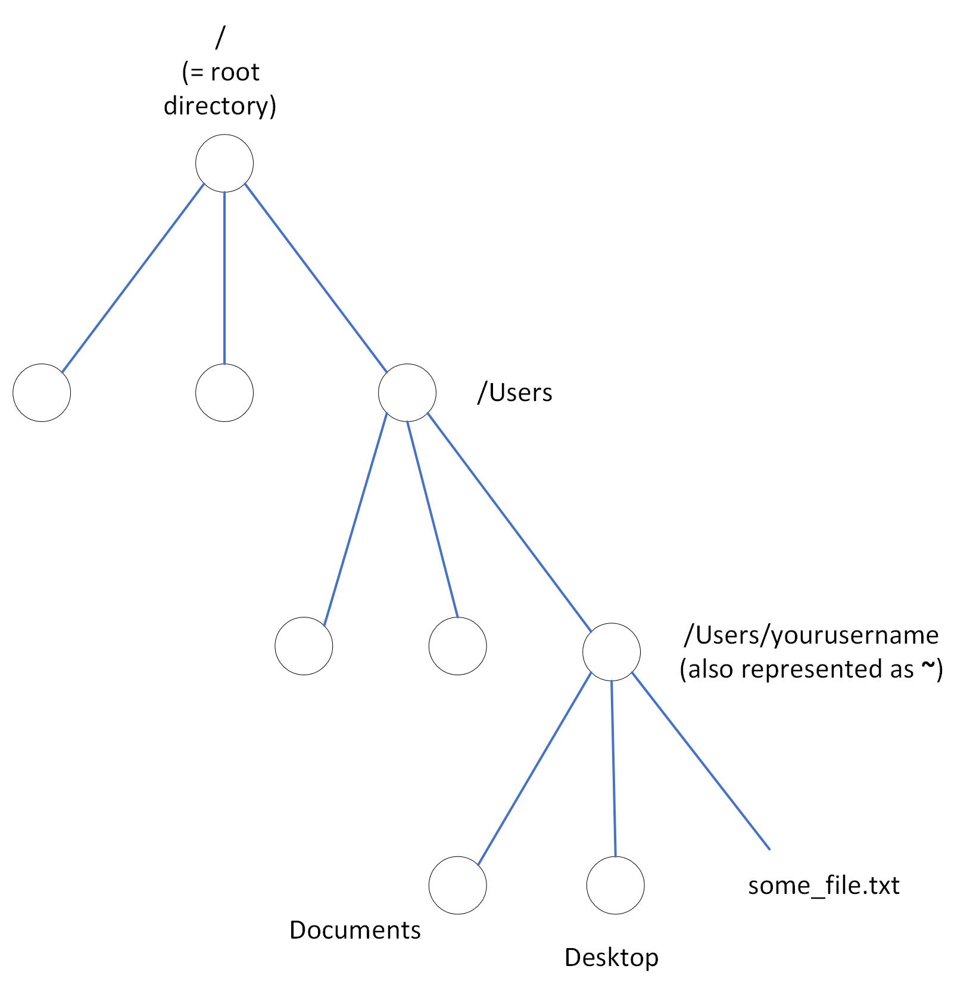

# Command line 2

## General

* **References:** Much of the content of these sessions is summarized at our [Command line quick reference](command_resources.md) page.
* **Credit:** Our materials are based on the Software Carpentry [Unix Shell](http://swcarpentry.github.io/shell-novice/) course
* **Something to play with:** Follow the instructions at <http://swcarpentry.github.io/shell-novice/setup.html> to copy some practice files.

## General review

* Absolute path: `/Users/mamo/Desktop/shell-lesson-data` (starts with a slash, which means "root directory", i.e. uppermost directory of the filesystem)
	* This is the one you get when you type `pwd`
* Relative path
	* `shell-lesson-data` (starting from `/Users/mamo/Desktop/`)
	* `Desktop/shell-lesson-data` (starting from `Users/mamo/Desktop`)
	* `..` (starting from `/Users/mamo/Desktop/shell-lesson-data/exercise-data`)
	* `../shell-lesson-data` (if we imagine to start from another directory contained in `/Users/mamo/Desktop/`)
	
* General structure of a command: `commmand -option(s) argument(s)`, e.g. `ls -F shell-lesson-data`
* `cd` to go to a directory
* `ls` to show what is inside a directory
* Need help? `man ls` or `ls --help`

## History and tab completion

### Review

* `history` (up and down arrows)
* `tab`: 1) Filename completion, 2) Command completion
* Editing the command line: `Ctrl + a`, `Ctrl + e`, `Ctrl + u`, `Option + click` (Mac only)

### And something new

* `!580` (execute the 580th command from the history)
* `!!` (execute the previous command)
* `!$`: last word of last command
* `Ctrl+r`: initiate (or continue) history search

## Working with directories

* `mkdir`: make directory
	* What’s a good name for a directory? And more in general: what's a good filename?
		* Avoid spaces (otherwise you'll be forced to use quotes `"..."` for arguments or backslashes `\`)
		* Avoid beginning hyphens, otherwise file and directory names might be mistaken for options/flags
	* What’s a good directory structure for a project?
* `mkdir -p a/b/c`: create intermediate directories
* `rmdir`: remove empty directory
* `rm -rf:` remove directory and its contents recursively (careful!)
* `rm -ri`: remove directory asking for confirmation (for single files)

## Working with files

* `cp`: copy
	* `cp oldfile newfile` copy a file
	* `cp oldfile1 oldfile2 newdirectory`: copy multiple files
	* `cp -r olddirectory newdirectory` copy directory recursively
* `mv`: rename / move
	* Rename a file or directory
	* Move a file or directory to a different location (optionally rename)
	* Be careful! It will automatically overwrite files with the same name, unless you add `-i` to make it interactive (will ask for permission)
* An easy way to create an empty file: `touch test.txt`
* `rm`: delete (careful—deletion is forever!)
* `rm -i`: delete after asking permission
* Editing and saving files (in your editor of choice)
	* Windows default is Notepad, Mac default is TextEdit
	* In this course, we will use [Atom](https://atom.io/)
	* Alternatives are:
		* [BBEdit](https://www.barebones.com/products/bbedit/) (only Mac)
		* [Notepad++](https://notepad-plus-plus.org/) (only Windows)
		* [Visual Studio Code](https://code.visualstudio.com/) (Mac, Windows, Linux)
	* Or use `vim` or `emacs` from the command line (<https://en.wikipedia.org/wiki/Editor_war>)
	* What’s a good filename?
		* Avoid spaces (otherwise you'll be forced to use quotes `"..."` for arguments or backslashes `\`)
		* Avoid beginning hyphens, otherwise file and directory names might be mistaken for options/flags
* Check the contents of a file
	* `cat /Users/djb/Documents/myfile.txt` (but not very useful to navigate through it)
	* `less /Users/djb/Documents/myfile.txt`

| Keystroke | Action |
| --------- | ------ |
| space | forward one window |
| b | backward one window |
| d | forward one half-window |
| u | backward one half-window |
| g | go to first line |
| G | go to last line |
| /pattern | search forward for pattern |
| ?pattern | search backward for pattern |
| n/N | next/previous search result |
| q | exit |

## Wildcards (“globbing”; annoyingly different from regex)

For this and the next sections, see <https://swcarpentry.github.io/shell-novice/04-pipefilter/index.html>.

### Examples

* `*.xml ` (files ending in “.xml”)
* `*.x?l` (files ending in “.x” followed by any single letter followed by “l”, e.g., XML [xml], XSLT [xsl], XProc [xpl] files)
* `*.x[ms]l` (files ending in “.x” followed by “m” or “s” followed by “l”, e.g., XML and XSLT files, but not XProc)

### Regex vs globbing

We will see what regex is in the following session.

* Regex: `*` and `?` are repetition indicators for the preceding item
* Globbing: `*` and `?` are wildcards
* Glob `*` = regex `.*`
* Glob `?` = regex `.?`

## Reading from and writing to files

* stdin, stdout, stderr
* `<`: input from file
* `>`: output to file (careful: overwrites existing files with the same name)
* `>>`: append to file (creates file if it doesn’t already exist)
* `2>`: error messages to file (`2> /dev/null`)

Save file listings with `ls`, file contents with `cat`, or command-line text with `echo`.

## Filters

### About filters

* Filters are programs that accept input on stdin and produce output on stdout.
* Stdin defaults to the keyboard and stdout defaults to the screen, but both can be redirected to or from a file or a pipe.
* Filters can be chained together to form computational pipelines.

### First filters

* `cat` (one or more files)
* `wc` (`-l` lines, `-w` words, `-c` characters)

Redirect input, contrast `wc file`, `wc < file`

### Filters and piping

* `|` pipes output of process on the left into input of process on the right
* `head` (`-10`, or any other number, or `-n 10`)
* `tail` (`-10`, or any other number, or `-n 10`)
* `sort` (`-r` reverse, `-u` unique, `-n` numeric); numeric vs alphabetic sorting
* `uniq` (only on sorted input)

### Practice

In `data-shell/north-pacific-gyre/2012-07-03` (experimental results; imagine hundreds of files):

* `wc -l *.txt`
* `wc -l *.txt | sort -n | head -n 5` (one is too short; bad data)
* `wc -l *.txt | sort -n | tail -n 5` (notice “Z”)
* `ls *Z.txt`
* `ls *AB[].txt`
* `ls *[^AB].txt`
